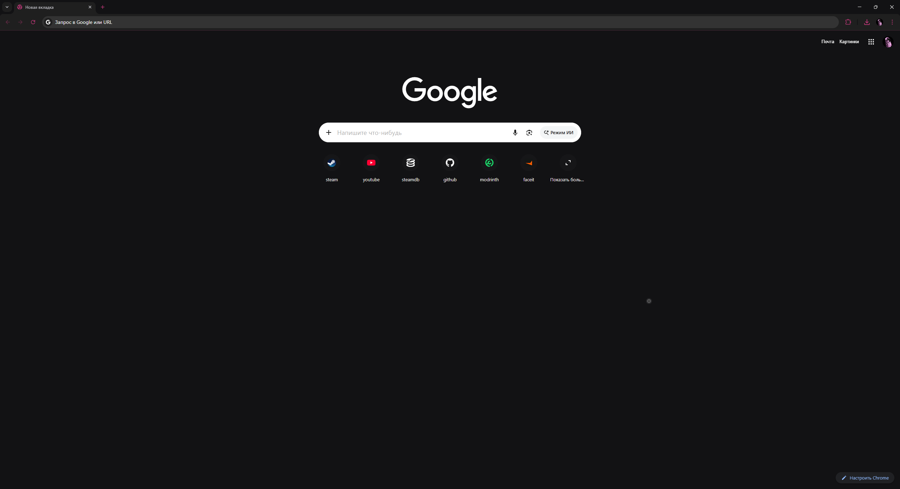

# 🌑 Chrome Dark Pink Theme

Minimalistic dark theme for Google Chrome with neon pink accents.
Designed for комфортной работы ночью и стильного вида интерфейса.

---

## ✨ Features

* 🖤 Deep dark UI (no pure black, easy on eyes)
* 🎀 Pink accent colors (links, highlights)
* 🧠 Good contrast for readability
* 🌙 Clean and minimal design
* ⚡ Lightweight (no scripts, only theme)

---

## 📸 Preview



---

## 📦 Installation

1. Click **Code → Download ZIP**
2. Extract the archive
3. Go to `chrome://extensions/`
4. Enable **Developer mode**
5. Click **Load unpacked**
6. Select extracted folder

---

## 🎨 Customization

You can edit `manifest.json`:

* Change colors in:

  ```json
  "colors": { ... }
  ```
* Adjust accents:

  ```json
  "ntp_link"
  "ntp_header"
  ```
* Experiment with `tints` for button styling
